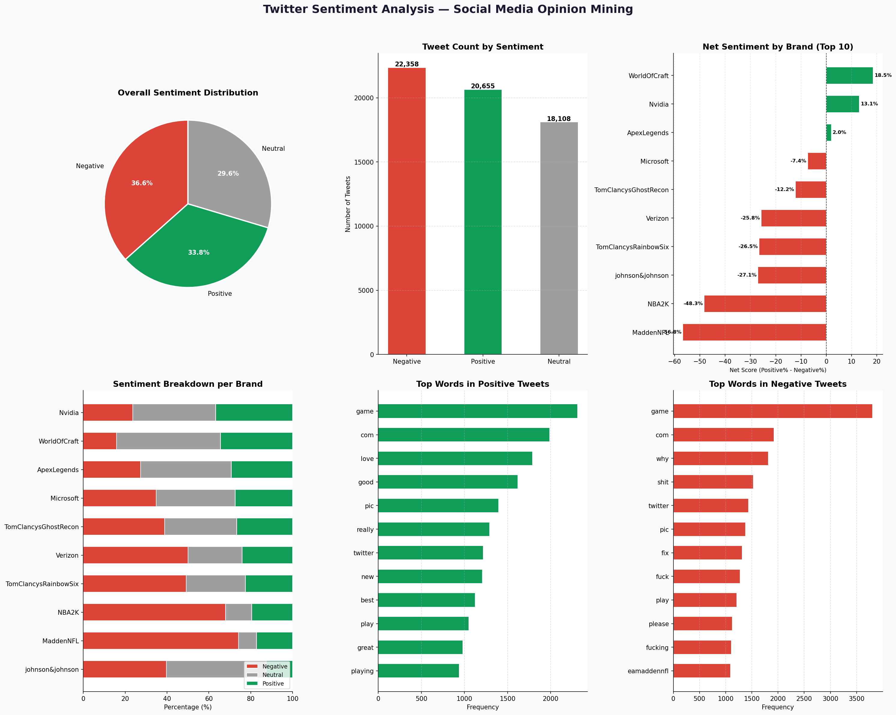

# PRODIGY_DS_04 — Twitter Sentiment Analysis

## Task Overview
Analyze and visualize sentiment patterns in social media data to 
understand public opinion and attitudes towards specific topics or brands.

**Internship:** Prodigy InfoTech — Data Science Track

## Dataset
- **Source:** Kaggle — Twitter Entity Sentiment Analysis
- **File:** twitter_training.csv
- **Size:** 74,682 tweets across 32 brands
- **After cleaning:** 61,121 tweets (removed irrelevant & nulls)

## What I Did
- Removed irrelevant and null tweets
- Analyzed sentiment distribution across all tweets
- Compared sentiment scores across top 10 brands
- Calculated net sentiment score per brand (Positive% - Negative%)
- Extracted most frequent words from positive and negative tweets

## Key Findings
- Sentiment split: **36.6% Negative · 33.8% Positive · 29.6% Neutral**
- **World of Warcraft** had the most positive sentiment (+18.5%)
- **Madden NFL** had the most negative sentiment (-56.8%)
- Positive tweets commonly used: game, love, good, great, play
- Negative tweets commonly used: game, bad, fix, hate, worst

## Visualizations


## Tools Used
- Python 3
- Pandas
- Matplotlib
- NumPy

## How to Run
```bash
pip install pandas matplotlib numpy
python task04_sentiment_analysis.py
```
